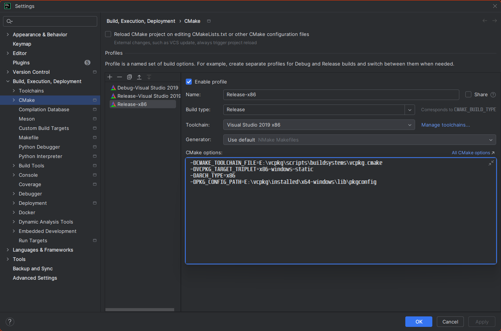

# Hook
This project is mainly about reversing Jindun Player, which is a pretty challenging project.
## How to use
First, You have to compile the dll.
It will be tough.
But I have a picture.

Then you need a Cheat Engine because this project don't supply dll injector.

In the CE, you also need to bp **ReadFile** API because we need main loop's position.
Then use AutoAssemble to insert Assemble to dump, or directly decode(without doing this).

Example

``` asm
alloc(newmem,2048)
label(returnhere)
label(originalcode)
label(exit)

newmem: //this is allocated memory, you have read,write,execute access
//place your code here

originalcode:
pushad
pushfd
push eax
push ebx
call core.dump_file
pop ebx
pop eax
popfd
popad

cmp esi,00000100

exit:
jmp returnhere

"WinPlayer0131.exe"+715169:
jmp newmem
nop
returnhere:

```